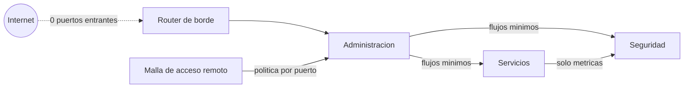

# Network Segmentation Playbook

> Segmentar por funcion, tratar el DNS como dependencia critica y justificar cada excepcion.

Este repositorio documenta, de forma sanitizada, el diseno de red de una infraestructura productiva personal (homelab): segmentacion por funcion dentro de un unico hipervisor,
DNS interno centralizado, y un caso real donde la propia segmentacion bloqueo
un flujo de monitoreo legitimo.

Es parte de un portfolio tecnico. **No es un laboratorio de prueba: es
infraestructura productiva.** No tiene la escala de una empresa, pero tiene
todas sus piezas -virtualizacion, red segmentada, DNS, almacenamiento, backups
con copia externa, monitoreo, SIEM, acceso remoto y aplicaciones en uso- y
funciona 24/7 sobre un hipervisor de tipo 1 en un servidor dedicado. Cuando
algo falla, el impacto es real.

La documentacion operativa es privada. Esto es su version transformada
-decisiones, patrones y aprendizajes-, sin datos que permitan identificar o
reproducir el entorno.

Lo que busca demostrar: criterio para segmentar una red por funcion cuando
el equipamiento fisico no da soporte nativo a esa segmentacion,
capacidad de razonar sobre DNS interno como dependencia critica, y el
habito de tratar cada excepcion a una regla de segmentacion como algo que se
documenta y se justifica, no como un atajo silencioso.

## Escala chica, exigencia de produccion

| Pieza | Que hace | Si falla |
|---|---|---|
| Virtualizacion | hipervisor de tipo 1, una maquina por funcion | cae todo lo demas |
| DNS interno | resolucion para todos los equipos y servicios | todo parece caido aunque este sano |
| Red y acceso remoto | zonas por funcion, malla sin puertos abiertos | se pierde el aislamiento o el acceso desde afuera |
| Almacenamiento y backups | NAS, backups nocturnos, copia cifrada externa, pruebas de restauracion | se pierde la capacidad de recuperar |
| Monitoreo, SIEM y alertas | metricas, eventos de seguridad, avisos al telefono | los incidentes pasan sin que nadie se entere |
| Aplicaciones propias | en uso diario; una envia correo real | se frena trabajo real |
| Remoto de codigo | versionado y despliegue de esas aplicaciones | no hay donde versionar ni desde donde desplegar |

Lo mismo que en una empresa, en chico: cambios con plan y rollback, evidencia,
alertas que avisan solas y controles que se prueban haciendolos fallar.

## En 30 segundos

| Indicador | Resultado |
|---|---|
| Puertos entrantes abiertos en el borde | **0** |
| Intentos no autorizados frenados por la politica en un solo incidente | **13.017** en 34 horas |
| Paquetes descartados por politica en los hosts que filtran | **19.256** |
| Superficie de gestion cerrada en el router | Telnet y web desde Wi-Fi, FTP, UPnP |
| Reglas de firewall muertas retiradas | **6** |

Detalle con cifras: [Resultados medidos](docs/02-resultados-medidos.md).

## Problema, decision, resultado

| Problema | Por que importaba | Que se hizo | Resultado |
|---|---|---|---|
| Un flujo de monitoreo legitimo quedaba bloqueado por la segmentacion | abrir la zona entera rompia el modelo | permitir solo colector hacia exportador, documentado | monitoreo restaurado sin lateralidad |
| El router traia Telnet accesible desde Wi-Fi y UPnP con un puerto huerfano | credenciales en texto plano y puertos sin dueno | endurecimiento completo del borde | 0 puertos entrantes, gestion solo por cable |
| Se iba a instalar un firewall nuevo sin saber que filtraba cada host | trabajo duplicado y riesgo de romper lo que andaba | relevar primero, con contadores reales | plan corregido, 6 reglas muertas retiradas |

El detalle de cada uno, con lo que salio mal en el camino, esta en los casos de estudio.

## Indice

- [Ficha rapida para quien evalua](contexto.md)
- [Arquitectura de red y segmentacion](docs/01-arquitectura-red-segmentacion.md)
- [Resultados medidos: que se filtro, que no y que se previno](docs/02-resultados-medidos.md)
- [Caso de estudio: monitoreo bloqueado por segmentacion](docs/casos-de-estudio/01-monitoreo-bloqueado-por-segmentacion.md)

## Parte de una serie

Este repo es una pieza de un proyecto mas grande: una **infraestructura
productiva personal** (homelab), encendida 24/7 y documentada en cinco repos
independientes. Cada uno se lee solo; juntos muestran el entorno completo.

- [Zero Trust Remote Access](https://github.com/Nicolasperaltait/zero-trust-remote-access)
- [Backups That Don't Lie](https://github.com/Nicolasperaltait/backups-that-dont-lie)
- [Alerts That Matter](https://github.com/Nicolasperaltait/alerts-that-matter)
- [Network Segmentation Playbook](https://github.com/Nicolasperaltait/network-segmentation-playbook) (este repo)
- [Hypervisor as Control Plane](https://github.com/Nicolasperaltait/hypervisor-as-control-plane)

## Licencia

Ver [LICENSE.md](LICENSE.md).
