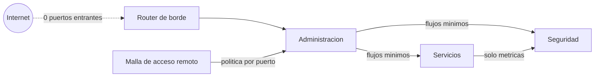

# Network Segmentation Playbook

> Segmentar por funcion, tratar el DNS como dependencia critica y justificar cada excepcion.

Este repositorio documenta, de forma sanitizada, el diseno de red de un
homelab personal: segmentacion por funcion dentro de un unico hipervisor,
DNS interno centralizado, y un caso real donde la propia segmentacion bloqueo
un flujo de monitoreo legitimo.

Es parte de un portfolio tecnico pensado para entrevistas de trabajo. No es
documentacion operativa de un entorno en produccion: es una version
transformada -decisiones, patrones y aprendizajes- de un homelab real, sin
datos que permitan identificarlo o reproducirlo.

Lo que busca demostrar: criterio para segmentar una red domestica por
funcion cuando la red fisica no da soporte nativo a esa segmentacion,
capacidad de razonar sobre DNS interno como dependencia critica, y el
habito de tratar cada excepcion a una regla de segmentacion como algo que se
documenta y se justifica, no como un atajo silencioso.

## En 30 segundos

| Indicador | Resultado |
|---|---|
| Puertos entrantes abiertos en el borde | **0** |
| Intentos no autorizados frenados por la politica en un solo incidente | **13.017** en 34 horas |
| Paquetes descartados por politica en los hosts que filtran | **19.256** |
| Superficie de gestion cerrada en el router | Telnet y web desde Wi-Fi, FTP, UPnP |
| Reglas de firewall muertas retiradas | **6** |

Detalle con cifras: [Resultados medidos](docs/02-resultados-medidos.md).

## Indice

- [Ficha rapida para quien evalua](contexto.md)
- [Arquitectura de red y segmentacion](docs/01-arquitectura-red-segmentacion.md)
- [Resultados medidos: que se filtro, que no y que se previno](docs/02-resultados-medidos.md)
- [Caso de estudio: monitoreo bloqueado por segmentacion](docs/casos-de-estudio/01-monitoreo-bloqueado-por-segmentacion.md)

## Parte de una serie

Este repo es una pieza de un proyecto mas grande: un **homelab personal**
operado como infraestructura real y documentado en cinco repos
independientes. Cada uno se lee solo; juntos muestran el entorno completo.

- [Zero Trust Remote Access](https://github.com/Nicolasperaltait/zero-trust-remote-access)
- [Backups That Don't Lie](https://github.com/Nicolasperaltait/backups-that-dont-lie)
- [Alerts That Matter](https://github.com/Nicolasperaltait/alerts-that-matter)
- [Network Segmentation Playbook](https://github.com/Nicolasperaltait/network-segmentation-playbook) (este repo)
- [Hypervisor as Control Plane](https://github.com/Nicolasperaltait/hypervisor-as-control-plane)

## Licencia

Ver [LICENSE.md](LICENSE.md).
