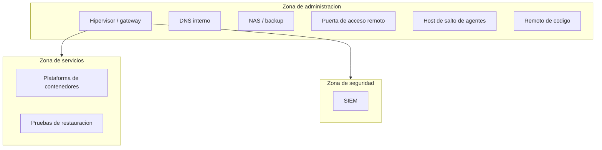

# Arquitectura de Red y Segmentacion

> Estado descrito: septiembre de 2026.

## Proposito

Describir la arquitectura de red de la infraestructura -segmentacion y DNS interno- de
manera clara y sanitizada.

## Principios de diseno

- segmentar por funcion
- evitar lateralidad innecesaria
- centralizar la administracion y la resolucion de nombres
- ningun puerto entrante en el borde
- priorizar trazabilidad y mantenibilidad
- crecer por capas, no por improvisacion, y retirar lo que deja de usarse

## Zonas logicas

| Zona | Proposito |
|---|---|
| Administracion | hipervisor, DNS, NAS, remoto de codigo, puerta de acceso remoto y host de salto |
| Servicios | contenedores, aplicaciones propias, observabilidad, proxy y la maquina de pruebas de restauracion |
| Seguridad | SIEM y telemetria |

La zona de acceso remoto dedicada se retiro: existia para un tunel punto a
punto que necesitaba un puerto entrante. El acceso remoto actual no es una
zona de red, es una capa superpuesta al direccionamiento (se documenta en el
repositorio de acceso remoto de este mismo portfolio).

## Modelo logico

## Por que la segmentacion vive en el hipervisor

La red fisica domestica no esta pensada para segmentacion avanzada, asi que
el aislamiento se implementa en el hipervisor. Eso lo vuelve doblemente
critico: es plataforma de computo y, a la vez, punto de transito, NAT y
control entre zonas.

## DNS interno

| Aspecto | Diseno |
|---|---|
| Rol | resolver con filtrado, servido por DHCP a toda la red |
| Dependencia | primera en el orden de arranque: si falla, servicios de otras zonas parecen caidos |
| Riesgo conocido | un unico resolver es punto unico de falla; un segundo resolver es mejora pendiente |

## Dependencias de primer orden

| Componente | Motivo |
|---|---|
| Hipervisor | concentra virtualizacion, transito y recuperacion |
| DNS interno | si falla, muchos servicios parecen caidos |
| Storage | impacta backups, retencion y recuperacion |
| Plataforma de contenedores | concentra apps, proxy y observabilidad |
| Puerta de acceso remoto | unico acceso desde fuera de casa |

## Publicacion de servicios

- acceso administrativo directo y controlado, sin exposicion externa
- servicios internos por nombre, a traves de un proxy inverso
- aplicaciones propias solo alcanzables por tunel, nunca publicadas
  directamente a internet
- ninguna exposicion externa desde el borde

## Convencion de nombres

Nombres internos por rol, dominios separados por zona y alias entendibles
para los servicios criticos. El naming real no se publica en este
repositorio.

## Flujos entre zonas: la regla y su excepcion

La segmentacion no significa bloquear todo trafico entre zonas. Significa
que cada flujo permitido entre zonas es:

- minimo (solo lo que hace falta, no la zona completa)
- explicito (declarado, no descubierto por accidente)
- documentado con su razon

El caso de estudio de este repositorio muestra un ejemplo real de esa regla
puesta a prueba: un flujo de monitoreo necesitaba cruzar de la zona de
servicios a la zona de administracion, y la resolucion no fue "abrir la
zona", sino habilitar exactamente ese flujo y dejarlo registrado.

## Lectura de la arquitectura

Esta arquitectura de red no compite por complejidad. Compite por claridad:
cada zona tiene un proposito, cada dependencia importante esta explicita, y
lo que dejo de tener razon se retiro (un tunel VPN con puerto entrante, entre
otros componentes dados de baja).
