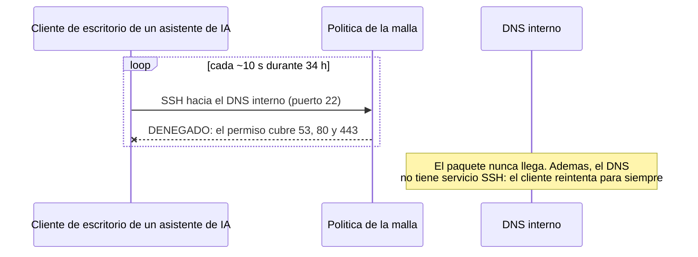
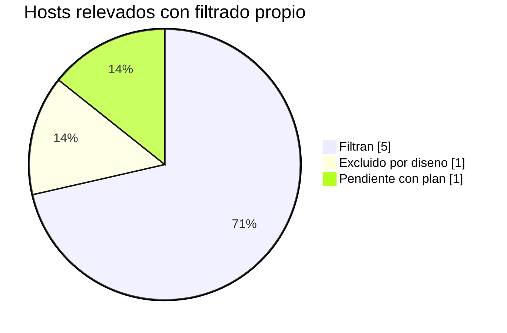

# Resultados Medidos: que se filtro, que no y que se previno

> Estado descrito: septiembre de 2026. Cifras tomadas de contadores y registros
> reales del entorno; se publican solo las cantidades, nunca direcciones ni nombres.

## Resumen

| Indicador | Resultado |
|---|---|
| Puertos entrantes abiertos en el borde | **0** |
| Intentos de acceso no autorizados frenados por la politica de la malla en un solo incidente | **13.017** en 34 horas |
| Servicios de gestion del router cerrados | **3** (uno de ellos, texto plano desde Wi-Fi) |
| Mapeos UPnP huerfanos eliminados | **1** (nadie sabia quien lo habia pedido) |
| Paquetes descartados por politica en los hosts que filtran | **19.256** contados al relevar |
| Reglas de firewall muertas detectadas y retiradas | **6** (cero paquetes contados) |
| Hosts con filtrado propio, de los 7 relevados | **5** (1 excluido por diseno, 1 pendiente con plan) |

## 1. El borde: antes y despues del endurecimiento

El router domestico del proveedor llego con valores de fabrica pensados para
comodidad, no para seguridad. Se revisaron todas las paginas de reglas.

| Superficie | Antes | Despues |
|---|---|---|
| Gestion por Telnet desde Wi-Fi | **habilitada** | deshabilitada |
| Gestion web desde Wi-Fi | habilitada | deshabilitada |
| FTP desde la red cableada | habilitado | deshabilitado |
| UPnP | **habilitado, con un mapeo activo** | deshabilitado, tabla vacia |
| Redireccion de puertos (IPv4 e IPv6) | vacia | vacia, verificada |
| DMZ | vacia | vacia, verificada |
| Nivel de firewall del equipo | S/D | maximo, verificado |
| Credencial de administracion | S/D | cambiada, guardada en gestor de contrasenas |

**El hallazgo mas grave fue Telnet desde Wi-Fi:** credenciales en texto plano,
alcanzables desde cualquier red inalambrica del sitio, incluida la de
invitados, porque el equipo no aisla una red de otra.

**El mapeo UPnP es la mejor ilustracion del problema de UPnP:** un puerto
abierto hacia internet apuntando a un equipo que ni siquiera tenia instalado
el software que supuestamente lo habia pedido. No se pudo determinar el
origen. Se cerro igual.

**Consecuencia aceptada:** el router solo se administra por cable.

## 2. Lo que la politica previno: 13.017 intentos en 34 horas

La malla de acceso remoto aplica **denegacion por defecto con permisos por
puerto**. Al construir la deteccion de rechazos de esa politica aparecio un
incidente real que nadie habia visto.

| Dato | Valor |
|---|---|
| Intentos denegados | **13.017** |
| Duracion | 34 horas |
| Ritmo | ~379 por hora, uno cada ~10 segundos |
| Origen | un asistente de IA de escritorio con una conexion remota configurada, reintentando sin fin |
| Que lo freno | la politica de la malla: ese destino solo admite DNS y web |
| Quien lo vio en el momento | **nadie**: los rechazos no tenian regla en el SIEM |
| Resolucion | se desactivo la conexion en el cliente: **cero intentos** en los 5 minutos siguientes |

**Lo que muestra:** la politica funciono exactamente como se diseno; la
segmentacion por puerto convirtio un error de configuracion de una
herramienta en ruido inofensivo. **Lo que fallo fue la visibilidad**, y eso
se cuenta en el repositorio [Alerts That Matter](https://github.com/Nicolasperaltait/alerts-that-matter).

## 3. Filtrado por host: lo que dice el contador

Al planificar un firewall nuevo se relevo primero que filtraba cada host.
**La mayoria ya filtraba, y no estaba documentado.** El plan cambio: completar
donde falta, con la herramienta que cada host ya usa.

| Rol del host | Filtra | Politica de entrada | Descartados al relevar |
|---|---|---|---|
| Hipervisor | **Si** | descarte por defecto | **12.229** |
| NAS | **Si** | descarte por defecto, convive con la malla | **7.019** |
| SIEM | **Si** | descarte por defecto | 8 |
| Pruebas de restauracion | **Si** | firewall propio | S/D |
| Host de salto de agentes de IA | **Si**, desde septiembre | firewall propio, con prueba negativa | S/D |
| Puerta de la malla | No, **por diseno** | reenvia trafico ajeno; su control es la politica de la malla | n/a |
| Host de contenedores | **No, pendiente** | ver abajo | n/a |

**Por que el host de contenedores no se resuelve "prendiendo el firewall":** el
motor de contenedores inserta sus reglas antes que las del firewall del host,
asi que los puertos publicados siguen alcanzables aunque el firewall los
niegue. Activarlo daria **una falsa sensacion de proteccion**. Y publicar solo
en la interfaz local rompe al proxy y al colector de metricas, que corren en
contenedores. La solucion correcta son redes internas entre contenedores.

**Correccion de criterio que salio del relevamiento:** se sostenia que la malla
y un firewall de host no conviven. En el NAS conviven. La regla aplica solo a la
puerta de la malla, que reenvia trafico que no le pertenece.

## 4. Higiene: reglas muertas

| Regla | Apuntaba a | Paquetes contados | Accion |
|---|---|---|---|
| Permisos a un equipo de la LAN | una direccion que ningun equipo usa | **0** | retirada |
| Permisos a un segmento | el segmento de un tunel dado de baja | **0** | retirada |

Seis reglas en total, en dos hosts. No abrian nada a un equipo existente,
pero **una regla que nadie entiende es una regla que nadie se anima a borrar**,
y ensucia la lectura de las que importan.

## 5. Flujos entre zonas

| Flujo | Origen | Destino | Resultado | Motivo |
|---|---|---|---|---|
| Recoleccion de metricas | colector, zona de servicios | exportadores de las otras zonas | **Permitido** | flujo minimo, declarado y documentado |
| Consulta directa a un exportador | otro equipo de la LAN | exportador de la zona de seguridad | **Bloqueado** | observado en el registro del firewall del host: el colector es el unico camino |
| Resolucion DNS | toda la red y la malla | DNS interno | **Permitido** | puertos de resolucion y web, nada mas |
| SSH al DNS interno | cualquiera por la malla | DNS interno | **Bloqueado** | ver seccion 2 |
| Conexion a la maquina del tunel retirado | cliente con una sesion vieja | maquina apagada | **Sin respuesta** | el tunel se dio de baja y su maquina quedo apagada |

## Lectura

La segmentacion no se demuestra con un diagrama. Se demuestra con lo que
**descarto**, con lo que **dejo pasar a proposito**, y con la honestidad de
mostrar el host que todavia no filtra y por que la solucion obvia seria un error.
