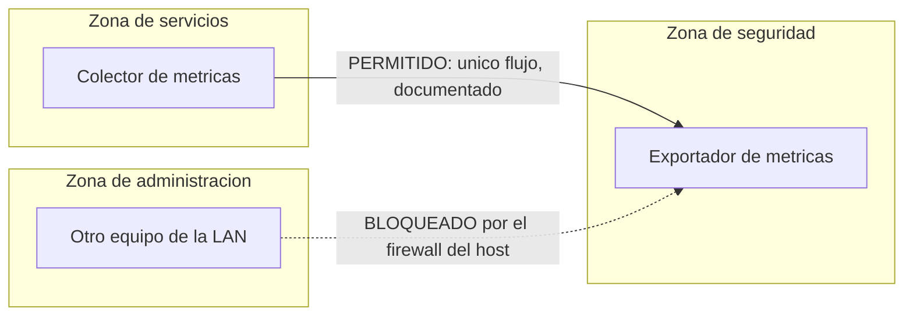

# Caso de Estudio - Monitoreo Bloqueado por Segmentacion

## Contexto

El lab separa servicios e infraestructura en zonas funcionales. Esa
segmentacion aporta seguridad, pero el monitoreo a veces requiere trafico
entre zonas cuidadosamente justificado.

## Sintoma

Un camino de observabilidad fallaba aunque el servicio monitoreado estaba
sano. El problema no era el dashboard; era el camino de red entre el
monitoreo y el objetivo de infraestructura, cortado por la propia
segmentacion.

## Decision

El patron de resolucion fue:

- mantener el modelo de segmentacion, sin excepciones amplias
- permitir solo el flujo de monitoreo necesario
- evitar abrir una zona completa por comodidad
- documentar la excepcion y su razon
- validar que el dashboard vuelva a representar metricas reales

## Como quedo

| Opcion evaluada | Resultado | Por que |
|---|---|---|
| Abrir la zona de seguridad a la de servicios | descartada | convierte una necesidad puntual en lateralidad general |
| Permitir solo colector hacia exportador, en su puerto | **adoptada** | minimo, explicito y documentado |

El registro del firewall del host mostro despues intentos bloqueados desde
otro equipo de la LAN hacia el mismo exportador: **la regla hace exactamente
lo que dice**, y nada mas.

## Validacion

El patron de validacion fue:

- verificar que la fuente de metricas esta sana
- verificar que el collector puede alcanzarla
- verificar que el dashboard usa datos frescos
- documentar la excepcion como flujo deliberado, no como agujero accidental

## Leccion aprendida

Segmentar no significa bloquear todo. Significa hacer que los flujos
permitidos sean explicitos, minimos y explicables. Una excepcion no
documentada es indistinguible de un error de diseno.
